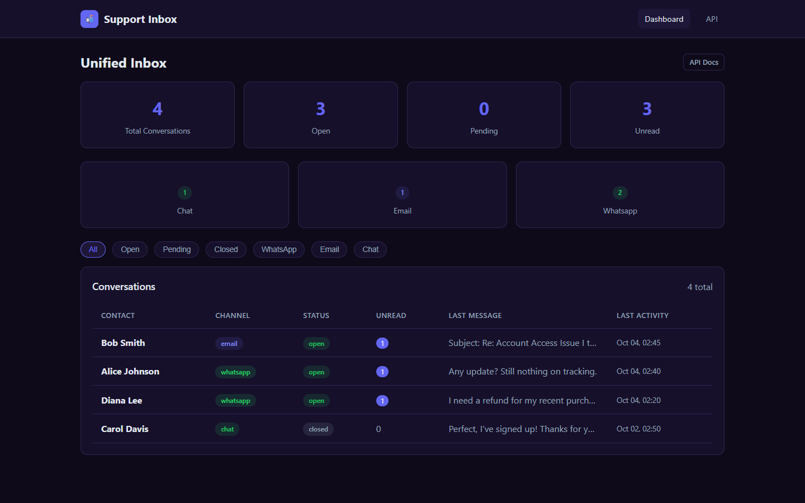
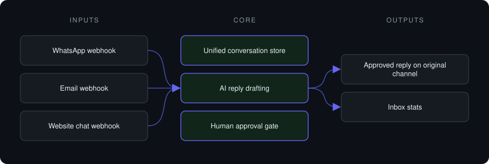
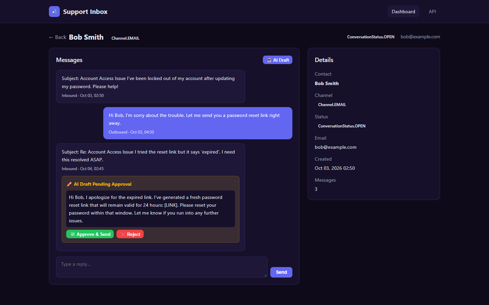

# n8n Support Inbox

**One inbox for WhatsApp, email and website chat, where AI drafts replies and a human approves them before sending.**

> **This is a proprietary project. Source code is private. This page showcases the system's architecture and results.**

**Case study page:** [https://jryahia.github.io/showcase-n8n-support-inbox/](https://jryahia.github.io/showcase-n8n-support-inbox/)

## Problem it solves

Support spread across WhatsApp, email and chat means context gets lost and replies are slow. Fully autonomous bots are risky for customer-facing answers. This inbox unifies the channels and keeps a human approval gate on every outbound AI draft. It is built as the webhook backend for a n8n scenario: the automation platform handles triggers, and this service holds the logic and data.

## Architecture

1. Messages from all three channels land as conversations in one store.
2. An agent can request an AI-drafted reply; it is saved as pending.
3. A human approves or rejects the draft.
4. Approved drafts are sent back on the original channel.

## Key features

- Single conversation list across channels
- AI drafts with an approve/reject lifecycle
- Channel and status filters
- Unread and pending counters
- Webhook endpoints ready for n8n

## Tech stack

     

## What it does in practice

- Gets the speed of drafted replies while keeping every outbound message human-approved.

## Screenshots

**Unified inbox across channels**

**Conversation with an AI draft awaiting human approval**

---

Built by [Yahya Jarray](https://github.com/jryahia). Interested in a similar system? [Get in touch](mailto:yahiajarray43@gmail.com).
